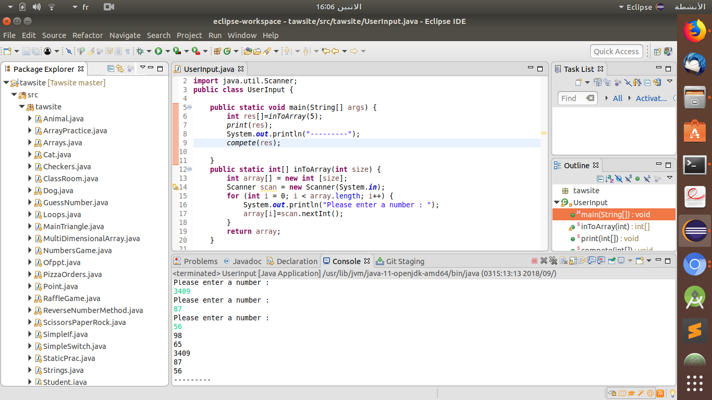

# Tawsite
# Console Apps via Java | Eclipse

Java Course in Udemy

<ol>
<li>
Pizza Orders |
* The user should enter his favorite topping then he will get a message about the availability of his chosen topping in our pizza
</li>

<li>
Guess the Number
* The user must guess a random number between 0 and 9 then he will get a message contain the right number
</li>

<li>

scissors paper rock console game
* A console application of the famous game of scissors,paper,rock
</li>

<li>

Friends raffle game
* The user enter a number of his friends names and the computer choose randomly one of them to be the winner
</li>

<li>

trivias king Game
the user's answers several questions and get rewarded with 50 $ for each correct answer,however get lose 50 $ for each wrong answer
</li>

<li>
The console apps covers all principal concepts of java programming like objects,constructors,inheritance,polymorphism
</li>

</ol>
